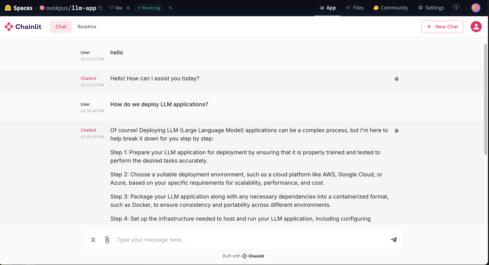

# LLM-Chainlit Chat Application

A streamlined chatbot application built with Chainlit and OpenAI's GPT-3.5 Turbo, designed to provide helpful responses in a pleasant conversational tone.

View application [here](https://huggingface.co/spaces/ovokpus/llm-app)



## 🌟 Features

- Interactive chat interface powered by Chainlit
- Integration with OpenAI's GPT-3.5 Turbo model
- Real-time streaming responses
- Docker containerization support
- Environment variable configuration for secure API key management

## 🛠️ Tech Stack

- Python
- Chainlit (UI Framework)
- OpenAI API
- Docker
- uv (Package Manager)

## 🚀 Getting Started

## 🔗 Introduction to Chainlit: Building LLM-Powered Apps Made Easy

As large language models (LLMs) like GPT and Claude become core components in modern AI applications, developers need tools that streamline their integration, testing, and deployment. **Chainlit** is one such open-source framework designed to bridge the gap between LLM backends and user-facing interfaces — quickly, efficiently, and with minimal code overhead.

### 🚀 What is Chainlit?

**Chainlit** is a lightweight Python framework that helps you build and deploy **conversational LLM applications** with ease. It provides an interface to connect LLM workflows (using LangChain, LlamaIndex, or custom chains) to an interactive frontend — all within a developer-friendly local environment or deployable app.

### 💡 Key Features

- **Zero-config UI**: Automatically spins up a local UI for testing your chatbot or assistant.
- **LangChain & LlamaIndex Integration**: Natively supports popular LLM frameworks and agents.
- **Real-time streaming**: Offers token-level output rendering for a responsive chat experience.
- **UI Customization**: Allows you to customize chat behavior, avatars, and inputs.
- **Easy Deployment**: Share your apps via local hosting or deploy to platforms like Streamlit, Hugging Face Spaces, or your own servers.

### 🛠️ Example Use Case

```python
import chainlit as cl

@cl.on_message
def handle_message(message: cl.Message):
    response = f"Echo: {message.content}"
    cl.Message(content=response).send()
```

In just a few lines, you get a working chat interface that echoes user input.

### 🧠 Ideal For:

- Prototyping and debugging LLM applications
- Teaching and demoing AI agents
- Building internal tools or research assistants
- Wrapping LangChain pipelines into interactive apps

### 🌐 Getting Started

Install Chainlit with:

```bash
pip install chainlit
```

Run your app with:

```bash
chainlit run app.py
```

---

## 🧾 Conclusion

Chainlit simplifies the journey from LLM-powered logic to a usable, interactive interface — empowering AI developers to focus on logic and workflows instead of frontend scaffolding. Whether you're building a smart assistant, research tool, or LLM wrapper, Chainlit is a great place to start.

---

Would you like a tutorial article showing how to use Chainlit with LangChain or OpenAI for a specific use case?

### Prerequisites

- Python 3.x
- OpenAI API key
- Docker (optional, for containerization)

### Installation

1. Clone the repository:

```bash
git clone <repository-url>
cd <repository-name>
```

2. Create and activate a virtual environment:

```bash
# Create virtual environment
uv venv

# Activate the environment
# On macOS/Linux:
source .venv/bin/activate
# On Windows:
# .venv\Scripts\activate
```

3. Install dependencies:

```bash
uv sync
```

4. Create a `.env` file in the root directory and add your OpenAI API key:

```env
OPENAI_API_KEY=your-api-key-here
```

### Running the Application

#### Local Development

```bash
uv run chainlit run app.py -w
```

#### Using Docker

1. Build the Docker image:

```bash
docker build -t llm-app .
```

2. Run the container:

```bash
docker run -p 7860:7860 llm-app
```

Visit `http://localhost:7860` in your browser to access the application.

## 💡 Usage

Once the application is running:

1. Open the provided URL in your browser
2. Type your message in the chat interface
3. Receive responses from the AI assistant in real-time

## 🔧 Configuration

The application can be configured through the following settings in `app.py`:

- Model: gpt-3.5-turbo
- Temperature: 0 (for consistent responses)
- Max tokens: 500
- Other OpenAI parameters can be adjusted in the settings dictionary

## 🐳 Docker Support

The project includes a Dockerfile for containerization, making it easy to deploy in any environment. The container exposes port 7860 for the web interface.

## 🔒 Security

- API keys are managed through environment variables
- Never commit your `.env` file to version control
- Use secrets management when deploying to production environments

## 🤝 Acknowledgement

A big shoutout to the @**AI Makerspace** for all making this possible. Couldn't have done it without the incredible community there. 🤗🙏

Looking forward to building with the community! 🙌✨ Here's to many more creations ahead! 🥂🎉
